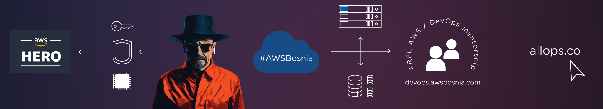

**Dzenan** runs AWS and DevOps consulting company [allOps Solutions](allops.co) specializing in high-impact **AWS projects**, including large-scale migrations, government initiatives, and HIPAA-compliant infrastructure implementations.

**With over a decade** of AWS experience dating back to 2011, Dzenan has managed AWS environments globally, including as a Production **Engineering team lead at Yahoo Inc.**, where he supported the **Yahoo Ad Tech** platform’s AWS infrastructure, serving millions of users worldwide.

Since founding the [AWS User Group Bosnia](https://www.awsbosnia.com/) in 2016, Dzenan has significantly expanded the community to over 1,000 members across three user groups. His contributions include organizing online meetups, maintaining an educational [YouTube channel](https://www.youtube.com/channel/UCFad2d7jXJdeNLdOOllG61A), and hosting a [Free DevOps Mentorship Program](https://www.devops.awsbosnia.com) aimed at supporting individuals from the Balkans in launching careers in cloud and DevOps.

### Connect with me 

[][website]
[][twitter]
[][linkedin]
[][youtube]
[][twitch]
 

[aws-hero]: https://aws.amazon.com/developer/community/heroes/dzenan-dzevlan/
[website]: https://www.devops.awsbosnia.com
[twitter]: https://twitter.com/sqlheisenberg
[linkedin]: https://linkedin.com/in/sqlheisenberg
[youtube]: https://www.youtube.com/channel/UCFad2d7jXJdeNLdOOllG61A
[twitch]: https://www.twitch.tv/sqlheisenberg

<!--
**sqlheisenberg/sqlheisenberg** is a ✨ _special_ ✨ repository because its `README.md` (this file) appears on your GitHub profile.

Here are some ideas to get you started:

- 🔭 I’m currently working on ...
- 🌱 I’m currently learning ...
- 👯 I’m looking to collaborate on ...
- 🤔 I’m looking for help with ...
- 💬 Ask me about ...
- 📫 How to reach me: ...
- 😄 Pronouns: ...
- ⚡ Fun fact: ...
-->
